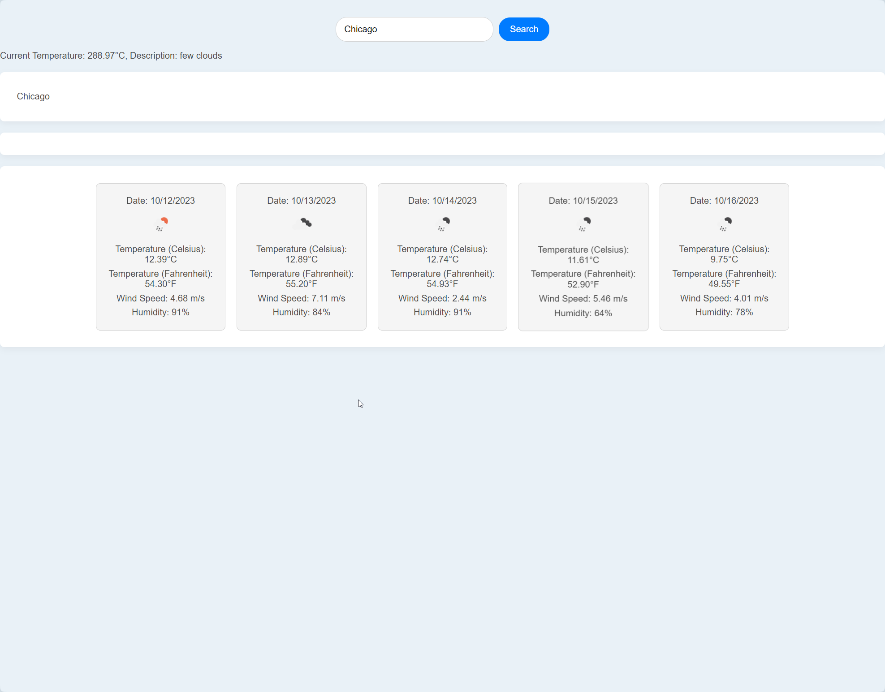

# Project Name

Brief description of what your project does. This should be a short paragraph that describes the purpose and functionality of your application.

## Table of Contents

- [Installation](#installation)
- [Usage](#usage)
- [Features](#features)
- [Contributing](#contributing)
- [License](#license)

## Installation
- Clone the Repo and run as a normal HTML.

## Usage
- Search a city by placing it in the input

## Features
- https://api.openweathermap.org/data/2.5/weather?q=${cityName}&appid=${apiKey} - Uses OpenWeatherAPI

## Contributing
- Chris Kirkley

## License
- MIT

## Screenshot
- 